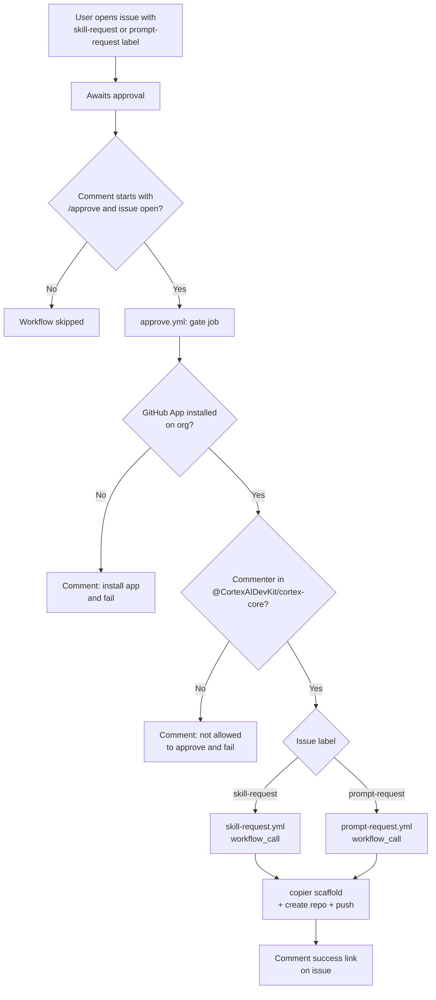

# cortex-ai-devkit-generator

This repository automates the creation of new Cortex AI DevKit skills and prompts repositories with the help of [copier](https://copier.readthedocs.io/en/stable/).

## Prerequisites

- A target GitHub organization where new repositories will be created.
- The GitHub App [`cortex-ai-devkit-bot`](https://github.com/apps/cortex-ai-devkit-bot/installations/new) installed on the target GitHub organization, with `Members: Read` permission so the approval workflow can verify team membership.
- A GitHub team named `cortex-core` in the target organization. Only members of this team are allowed to approve requests.

> [!WARNING]
> If the GitHub App [`cortex-ai-devkit-bot`](https://github.com/apps/cortex-ai-devkit-bot/installations/new) is not installed, or the target organization already has a repository with the same name, the workflow will fail. A comment will be added on the issue explaining why.

## How to Use ?

1. Open a [new issue](https://github.com/CortexAIDevKit/cortex-ai-devkit-generator/issues/new/choose) using either the **Skill request** or **Prompt request** template.
2. Fill in the fields and submit the issue.
3. A member of the [`@CortexAIDevKit/cortex-core`](https://github.com/orgs/CortexAIDevKit/teams/cortex-core) team reviews the request and comments `/approve` on the issue to trigger scaffolding.

## Workflows

## Contact

If you have any enhancement suggests or issues, feel free to open a thread in the [discussions](https://github.com/CortexAIDevKit/cortex-ai-devkit-lab/discussions)